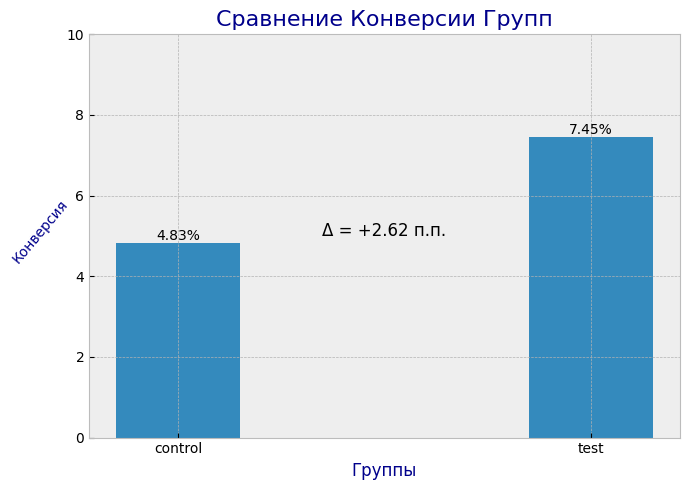

# A/B-тест баннера кредитной карты в мобильном приложении

## 1. Контекст и постановка задачи
Тест-Банк стремится увеличить конверсию клиентов в оформление кредитных карт. Для повышения видимости кредитного продукта в мобильном приложении рядом с блоком дебетовых карт исторически размещается рекомендательный баннер с предложением оформить кредитную карту с бесплатным обслуживанием.

Продуктовая команда предполагает, что акцент на конкретной выгоде для клиента может повысить привлекательность продукта по сравнению с более общим предложением бесплатного обслуживания. Для проверки данной гипотезы банк запускает A/B-тест в мобильном приложении.

Цель эксперимента — оценить влияние различных ценностных предложений кредитной карты на конверсию клиентов в оформление продукта и определить наиболее эффективный вариант коммуникации для дальнейшего масштабирования на всю аудиторию мобильного приложения.

<h4 align="center">Исходный датафрейм с выборкой клиентов для анализа</h4>

|    |   row_number |   customer_id | surname   |   credit_score | geography   | gender   |   age |   tenure |   balance |   num_of_products |   estimated_salary |   active_user |
|---:|-------------:|--------------:|:----------|---------------:|:------------|:---------|------:|---------:|----------:|------------------:|-------------------:|--------------:|
|  0 |            1 |      15634602 | Hargrave  |            619 | France      | Female   |    42 |        2 |       0   |                 1 |           101349   |             1 |
|  1 |            2 |      15647311 | Hill      |            608 | Spain       | Female   |    41 |        1 |   83807.9 |                 1 |           112543   |             0 |
|  2 |            3 |      15619304 | Onio      |            502 | France      | Female   |    42 |        8 |  159661   |                 3 |           113932   |             1 |
|  3 |            4 |      15701354 | Boni      |            699 | France      | Female   |    39 |        1 |       0   |                 2 |            93826.6 |             0 |
|  4 |            5 |      15737888 | Mitchell  |            850 | Spain       | Female   |    43 |        2 |  125511   |                 1 |            79084.1 |             0 |
|  5 |            6 |      15574012 | Chu       |            645 | Spain       | Male     |    44 |        8 |  113756   |                 2 |           149757   |             1 |
|  6 |            7 |      15592531 | Bartlett  |            822 | France      | Male     |    50 |        7 |       0   |                 2 |            10062.8 |             0 |
|  7 |            8 |      15656148 | Obinna    |            376 | Germany     | Female   |    29 |        4 |  115047   |                 4 |           119347   |             1 |
|  8 |            9 |      15792365 | He        |            501 | France      | Male     |    44 |        4 |  142051   |                 2 |            74940.5 |             0 |
|  9 |           10 |      15592389 | H?        |            684 | France      | Male     |    27 |        2 |  134604   |                 1 |            71725.7 |             0 |

## 2. Гипотезы

#### Нулевая гипотеза (H₀)
Конверсия в оформление кредитной карты одинакова в обеих группах. (P(A)=P(B))

#### Альтернативная гипотеза (H₁)
Предложение с кешбэком 10% на такси и кофе в первый месяц обеспечивает более высокую конверсию в оформление кредитной карты по сравнению с предложением бесплатного обслуживания. (P(B)>P(A))

## 3. Дизайн эксперимента

### 3.1. Варианты эксперимента

| Группа | Текст баннера |
| --- | --- |
| A (Control) | Оформите кредитную карту с бесплатным обслуживанием |
| B (Test) | Оформите кредитную карту с кешбэком 10% на такси и кофе в первый месяц |

### 3.2. Unit of Randomization

В качестве единицы рандомизации используется customer_id. Каждый клиент может попасть только в одну экспериментальную группу на протяжении всего теста.

### 3.3. Механизм распределения по группам

Распределение пользователей между группами выполняется детерминированным способом с использованием хеш-функции.
<div align="center">
<b>group = hash(customer_id + salt) % 100</b><br>
<b>0–49 → Control</b><br>
<b>50–99 → Test</b>
</div>

### 3.4. Параметры эксперимента

| Параметр | Значение | Обоснование |
| --- | --- | --- |
| Размер экспериментальной аудитории | 10000 | Количество клиентов, соответствующих критериям участия в эксперименте |
| Уровень значимости (α) | 0.05 | Стандартное значение в A/B-тестировании |
| Мощность теста (Power) | 0.8 | Общепринятый уровень для обнаружения эффекта |
| Базовая конверсия (Baseline CR) | 5% | Предполагаемая конверсия оформления кредитной карты в контрольной группе |
| Минимально обнаружимый эффект (MDE)* | +1.22 п.п | Получается исходя из формулы MDE |
| Длительность эксперимента | 14 дней | Время, необходимое пользователю для принятия решения об оформлении карты |

<h4 align="center">Расчёт минимально обнаружимого эффекта (MDE)</h4>

$$
MDE \approx \left(Z_{1-\alpha/2} + Z_{1-\beta}\right)
\times
\sqrt{\frac{2p(1-p)}{n}}
$$

``` python 
from scipy.stats import norm
import numpy as np

alpha = 0.05
power = 0.8
p = 0.05
n = 5000

z_alpha = norm.ppf(1 - alpha / 2)
z_beta = norm.ppf(power)

mde = (z_alpha + z_beta) * np.sqrt((2 * p * (1 - p)) / n)

print(f"MDE = {mde:.4%}")
```
**MDE = 1.2212%**

## 4. Метрики

**Target Metric:** Конверсия (CR) в оформление кредитной карты.
<br>**Proxy Metric:** CTR рекомендательного баннера.
<br>**Guardrail Metrics:**
<br>1. Доля отказов от взаимодействия с баннером
<br>2. Время, проведённое пользователем в приложении
<br>3. Количество технических ошибок на пути оформления продукта

В рамках настоящего кейса анализ проводился исключительно по целевой метрике. 
Proxy- и guardrail-метрики были определены как потенциально значимые для оценки побочных эффектов эксперимента, однако не анализировались из-за отсутствия соответствующих данных.

## 5. Проведение A/B теста
### 5.1. Распределение пользователей по группам
```python
salt = "credit_card_ab_test_01"

import hashlib

def get_bucket(customer_id, salt):
    value = f"{customer_id}_{salt}"
    hash_value = hashlib.md5(value.encode()).hexdigest()
    return int(hash_value, 16) % 100

def assign_group(customer_id, salt):
    return "control" if get_bucket(customer_id, salt) < 50 else "test"

df["bucket"] = df["customer_id"].apply(lambda x: get_bucket(x, salt))
df["group"] = df["customer_id"].apply(lambda x: assign_group(x, salt))

df["group"].value_counts().sort_index()
```

| group   |   count |
|:--------|--------:|
| control |    4884 |
| test    |    5116 |

<br>
Для имитации результатов A/B-теста пользователям контрольной и тестовой групп задаются различные вероятности оформления кредитной карты:

``` python
control = 0.05
test = 0.07

df["booking"] = np.where(
    df["group"] == "control",
    np.random.binomial(1, control, len(df)),
    np.random.binomial(1, test, len(df)))
```

| group   |   total_count |   conversions |   conversion_rate |
|:--------|--------------:|--------------:|------------------:|
| control |          4884 |           228 |         0.046683  |
| test    |          5116 |           388 |         0.0758405 |

<div align="center">
    
    <br>
    <em>Рис. 1 - Сравнение конверсий между группами</em>
</div>

<br>
Находим z и p-value и строим доверительный интервал:

``` python
from statsmodels.stats.proportion import proportions_ztest
conversions = [228, 388]
total_count = [4884, 5116]

z, p_value = proportions_ztest(
    count=conversions,
    nobs=total_count)

from statsmodels.stats.proportion import confint_proportions_2indep

ci_low, ci_high = confint_proportions_2indep(
    count1 = 388,
    nobs1 = 5116,
    count2 = 228,
    nobs2 = 4884,
    method="wald")

print(f"z = {z}")
print(f"p_value = {p_value}")
print(f"95% CI = [{ci_low:.4%}; {ci_high:.4%}]")
```

#### Результаты статистического теста
```markdown
- Z-статистика: 6.0620
- p-value: 1.34 × 10⁻⁹
- 95% CI: [1.9796%; 3.8519%]
```
Поскольку p-value значительно меньше уровня значимости α = 0.05, нулевая гипотеза отвергается. 
Полученные результаты свидетельствуют о статистически значимом различии между контрольной и тестовой группами.

## 6. Выводы и рекомендации
#### По результатам эксперимента:
- Конверсия в оформление кредитной карты в контрольной группе составила **4.67%**.
- Конверсия в тестовой группе составила **7.58%**.
- Абсолютный прирост конверсии составил **2.92 п.п.**.
- Полученный эффект превышает минимально обнаружимый эффект (**MDE = 1.22 п.п.**).
- Нулевая гипотеза отвергается в пользу альтернативной. (**p-value < 0.05**).
- 95%-й доверительный интервал не включает ноль, что подтверждает устойчивость полученного эффекта.

#### Рекомендации
- Рассмотреть вариант баннера с кэшбэком как более перспективный для дальнейшего тестирования на реальных пользователях.
- Провести дополнительные эксперименты по тестированию размера кэшбэка.
- Проверить влияние различных категорий повышенного кэшбэка на конверсию.
- Исследовать эффективность персонализированных предложений для различных клиентских сегментов.

#### Ограничения исследования
- Эксперимент выполнен на синтетически сгенерированных данных.
- Конверсии контрольной и тестовой групп были смоделированы для демонстрации полного цикла проведения A/B-теста.
---

**Инструменты проекта**
- Python (pandas, statsmodels, matplotlib, hashlib, scipy)
